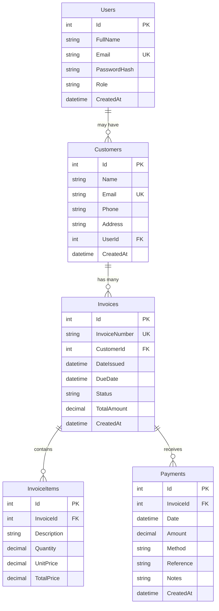

# Database Schema - Billing & Payment System

## Entity Relationship Diagram



## Table Descriptions

### Users Table
**Purpose:** Stores system users with authentication information and role-based access control.

| Column | Type | Constraints | Description |
|--------|------|-------------|-------------|
| Id | int | PRIMARY KEY, IDENTITY | Unique identifier |
| FullName | nvarchar(150) | NOT NULL | User's full name |
| Email | nvarchar(256) | NOT NULL, UNIQUE | Login email address |
| PasswordHash | nvarchar(MAX) | NOT NULL | BCrypt hashed password |
| Role | nvarchar(50) | NOT NULL, DEFAULT 'Customer' | User role (Admin/Accountant/Customer) |
| CreatedAt | datetime2 | NOT NULL, DEFAULT GETUTCDATE() | Account creation timestamp |

**Indexes:**
- Unique index on Email

**Roles:**
- **Admin**: Full system access, can manage users
- **Accountant**: Can manage customers, invoices, and payments
- **Customer**: Can view their own invoices and payments

---

### Customers Table
**Purpose:** Stores customer information for billing.

| Column | Type | Constraints | Description |
|--------|------|-------------|-------------|
| Id | int | PRIMARY KEY, IDENTITY | Unique identifier |
| Name | nvarchar(150) | NOT NULL | Customer name |
| Email | nvarchar(256) | NULL, UNIQUE | Contact email |
| Phone | nvarchar(50) | NULL | Contact phone number |
| Address | nvarchar(500) | NULL | Physical address |
| UserId | int | NULL, FOREIGN KEY → Users(Id) | Optional link to user account |
| CreatedAt | datetime2 | NOT NULL, DEFAULT GETUTCDATE() | Record creation timestamp |

**Indexes:**
- Unique filtered index on Email (WHERE Email IS NOT NULL)
- Index on UserId

**Relationships:**
- Optional many-to-one with Users (a customer may have a user account)
- One-to-many with Invoices

---

### Invoices Table
**Purpose:** Stores invoice headers with status and totals.

| Column | Type | Constraints | Description |
|--------|------|-------------|-------------|
| Id | int | PRIMARY KEY, IDENTITY | Unique identifier |
| InvoiceNumber | nvarchar(50) | NOT NULL | Auto-generated invoice number (format: INV-YYYYMM-NNN) |
| CustomerId | int | NOT NULL, FOREIGN KEY → Customers(Id) | Customer reference |
| DateIssued | datetime2 | NOT NULL | Invoice issue date |
| DueDate | datetime2 | NULL | Payment due date |
| Status | nvarchar(50) | NOT NULL, DEFAULT 'Pending' | Invoice status (Pending/Paid/Overdue/Cancelled) |
| TotalAmount | decimal(18,2) | NOT NULL | Total invoice amount |
| CreatedAt | datetime2 | NOT NULL, DEFAULT GETUTCDATE() | Record creation timestamp |

**Indexes:**
- Index on CustomerId
- Index on InvoiceNumber
- Index on DateIssued
- Index on Status

**Computed Properties:**
- **PaidAmount**: Sum of all payment amounts for this invoice
- **RemainingAmount**: TotalAmount - PaidAmount

**Status Values:**
- **Pending**: Invoice issued, not yet paid, not overdue
- **Paid**: Fully paid
- **Overdue**: Past due date and not paid
- **Cancelled**: Invoice cancelled

**Relationships:**
- Many-to-one with Customers
- One-to-many with InvoiceItems (cascade delete)
- One-to-many with Payments (restrict delete)

---

### InvoiceItems Table
**Purpose:** Stores individual line items for each invoice.

| Column | Type | Constraints | Description |
|--------|------|-------------|-------------|
| Id | int | PRIMARY KEY, IDENTITY | Unique identifier |
| InvoiceId | int | NOT NULL, FOREIGN KEY → Invoices(Id) | Parent invoice reference |
| Description | nvarchar(500) | NOT NULL | Item description |
| Quantity | decimal(18,2) | NOT NULL | Quantity of items |
| UnitPrice | decimal(18,2) | NOT NULL | Price per unit |
| TotalPrice | decimal(18,2) | NOT NULL | Quantity × UnitPrice |

**Indexes:**
- Index on InvoiceId

**Relationships:**
- Many-to-one with Invoices (cascade delete when invoice is deleted)

---

### Payments Table
**Purpose:** Records all payments received against invoices.

| Column | Type | Constraints | Description |
|--------|------|-------------|-------------|
| Id | int | PRIMARY KEY, IDENTITY | Unique identifier |
| InvoiceId | int | NOT NULL, FOREIGN KEY → Invoices(Id) | Invoice being paid |
| Date | datetime2 | NOT NULL | Payment date |
| Amount | decimal(18,2) | NOT NULL, CHECK (Amount > 0) | Payment amount |
| Method | nvarchar(50) | NOT NULL, DEFAULT 'Cash' | Payment method |
| Reference | nvarchar(100) | NULL | Reference number (check number, transaction ID, etc.) |
| Notes | nvarchar(500) | NULL | Additional notes |
| CreatedAt | datetime2 | NOT NULL, DEFAULT GETUTCDATE() | Record creation timestamp |

**Indexes:**
- Index on InvoiceId
- Index on Date

**Payment Methods:**
- Cash
- Credit Card
- Bank Transfer
- Check
- Other

**Relationships:**
- Many-to-one with Invoices (restrict delete - cannot delete invoice with payments)

**Business Rules:**
- Payment amount must be > 0
- Total payments for an invoice cannot exceed invoice total amount
- When total payments = invoice total, invoice status automatically updates to "Paid"
- When a payment is deleted, invoice status is recalculated

---

## Business Logic

### Invoice Numbering
- Format: `INV-YYYYMM-NNN`
- Example: `INV-202511-001`
- Auto-incremented per month

### Invoice Status Management
1. **Created**: Status = "Pending"
2. **Partial Payment**: Status remains "Pending"
3. **Full Payment**: Status automatically changes to "Paid"
4. **Past Due Date**: Status displayed as "Overdue" (calculated, not stored)

### Payment Validation
- Payment amount must not exceed remaining invoice amount
- Cannot delete payment records (enforced by database constraint)
- Invoice status automatically recalculates when payments are added/removed

### Data Integrity
- Email uniqueness enforced for Users and Customers
- Cannot delete invoice with payments (RESTRICT constraint)
- InvoiceItems cascade delete when invoice is deleted
- All decimal amounts use precision (18,2)

---

## Sample Queries

### Get Overdue Invoices
```sql
SELECT * FROM Invoices
WHERE DueDate < GETDATE()
  AND Status != 'Paid'
  AND Status != 'Cancelled'
ORDER BY DueDate
```

### Get Invoice with Full Details
```sql
SELECT 
    i.*,
    c.Name AS CustomerName,
    c.Email AS CustomerEmail,
    (SELECT SUM(Amount) FROM Payments WHERE InvoiceId = i.Id) AS PaidAmount
FROM Invoices i
INNER JOIN Customers c ON i.CustomerId = c.Id
WHERE i.Id = @InvoiceId
```

### Get Customer's Invoice Summary
```sql
SELECT 
    c.Name,
    COUNT(i.Id) AS TotalInvoices,
    SUM(i.TotalAmount) AS TotalAmount,
    SUM(ISNULL((SELECT SUM(p.Amount) FROM Payments p WHERE p.InvoiceId = i.Id), 0)) AS PaidAmount
FROM Customers c
LEFT JOIN Invoices i ON c.Id = i.CustomerId
GROUP BY c.Id, c.Name
ORDER BY TotalAmount DESC
```
